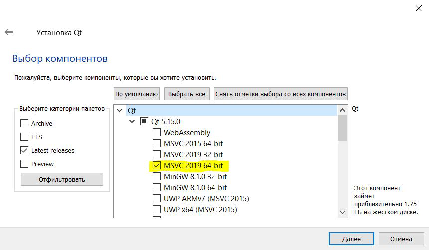

# D3ds

This is the official repository for the source and the binaries of D3ds.

D3ds is an open source portable system for the processing and editing 3D triangular meshes. These tools with a graphical user interface.

D3ds is mostly based on the open source C++ mesh processing library VCGlib developed at the Visual Computing Lab of ISTI - CNR and Qt libs. 

D3ds is available for Windows

# Releases

You can find the last D3ds release in master branch.

# Build instructions

1) First of all need to install QtCreator:     

	a) Download Qt open source:   
		https://www.qt.io/download-thank-you?hsLang=en        

	b) Install:     
		1) Run downloaded file   
		2) Sign Up in Qt and then Sign In     
		3) Choose install Directory as C:\Qt (as default)       
		4) Choose Qt 5.15.0 -> Mark MSVC 2019 64-bit as on picture       
		5) Next steps as default

2) Install VS2019:     
	
	a) Download Visual Studio Community 2019:     
		https://visualstudio.microsoft.com/thank-you-downloading-visual-studio/?sku=Community&rel=16     
	
	b) Install:     
		1) Run downloaded file    
		2) All step by default until choose components.    
		3) Choose the next path (as default) and components       
		4) Next steps by default     
		5) After Vs2019 installed, restart computer       

3) Clone D3ds project in your directory     
4) Run batBuilder.bat        
5) Executable file will be create in BuildDir\release\d3ds.exe     
6)Enjoy    

 
# License

 The D3ds source is released under the [LGPL License](LICENSE.txt).
 
# Copyright

   VCGLib  http://www.vcglib.net                                        
   Qt     https://www.qt.io/                        
                                                                 
   Visual Computing Lab  http://vcg.isti.cnr.it                       
   ISTI - Italian National Research Council                             
   Copyright(C) 2005-2018                                               

